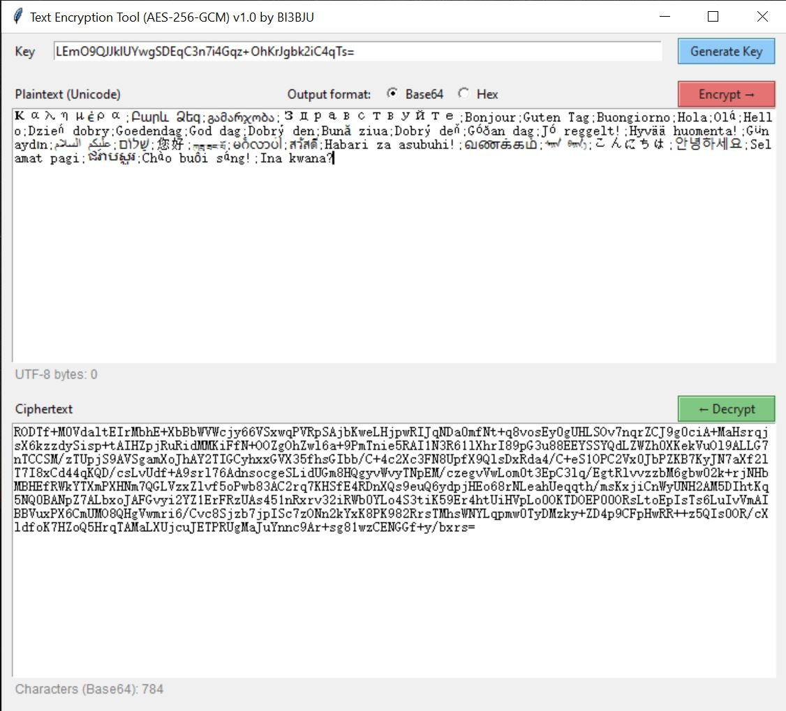

# AES-256-GCM Text Encryption Tool

[]

---

## Screenshots

| Main |
| :---: |
|  |

### 📖 Introduction

**AES-256-GCM Text Encryption Tool** is a lightweight desktop application built with Python and Tkinter, designed to securely encrypt and decrypt arbitrary Unicode text.  
It uses the industry-standard AES-256-GCM authenticated encryption algorithm, supports both Base64 and Hex output formats, and automatically detects the encoding of input ciphertext – making it extremely easy to use.

Developed by BI3BJU, this open-source project is ideal for personal privacy protection, password management assistance, and more.

### ✨ Features

- ✅ AES-256-GCM encryption – ensures confidentiality, integrity, and authenticity
- 🔑 Flexible key input – accepts any text (derived via SHA-256) or a 32-byte Base64 random key (recommended)
- 🎲 One-click random key generation – uses system-secure RNG and auto-copies to clipboard
- 📋 Automatic clipboard integration – results are copied to clipboard after encryption/decryption
- 🔄 Auto-detection of ciphertext format – no need to select Base64 or Hex manually when pasting; the program decodes it automatically
- 📊 Real-time statistics – shows UTF-8 byte count of plaintext and ciphertext length (characters for Base64, bytes for Hex) based on current format
- 🌐 Bilingual UI (English/Chinese) – switches based on system language (Windows / Linux / macOS)
- 🖱️ Right-click context menu – supports copy, paste, cut, select all, clear for efficient editing
- 🎨 Clean and intuitive UI – clear layout with a status bar giving real-time feedback

### 🚀 Quick Start

#### Requirements
- Python 3.6+
- Dependency: cryptography (Tkinter is built-in with Python)

#### Install dependency
Run command: `pip install -r requirements.txt`

#### Run the program
Run command: `python main.py`

### 🧩 Usage Guide

1. **Key**  
   - You may enter any arbitrary text (e.g., a passphrase); the program will hash it with SHA-256 to derive a 32-byte key.  
   - It is highly recommended to click the “Generate Key” button to obtain a high-entropy Base64 random key and store it securely.  
   - The input field shows a placeholder hint, encouraging the use of a password manager for strong key generation.

2. **Encryption**  
   - Type your plaintext in the “Plaintext” area.  
   - Choose output format (Base64 or Hex).  
   - Click “Encrypt →” – the ciphertext will appear in the “Ciphertext” area and be automatically copied to your clipboard.  
   - The ciphertext length statistics will update accordingly.

3. **Decryption**  
   - Paste the ciphertext (Base64 or Hex, automatically detected) into the “Ciphertext” area.  
   - Ensure the correct key is entered.  
   - Click “← Decrypt” – upon success, the plaintext is displayed and copied to clipboard.

4. **Real-time statistics**  
   - Below the plaintext area, the UTF-8 byte count is shown.  
   - Below the ciphertext area, the length is displayed: characters for Base64, bytes for Hex. If the ciphertext is invalid, a warning appears.

5. **Context Menu**  
   - Right-click (or two-finger tap on touchpad) inside any text box to open a context menu for copy, paste, cut, select all, and clear.

### 🔒 Security Notes

- Algorithm: AES-256-GCM (Galois/Counter Mode) – an authenticated encryption mode that detects tampering and wrong keys.  
- Nonce: A fresh 12-byte nonce is generated for each encryption (using os.urandom), ensuring that identical plaintexts yield different ciphertexts.  
- Key derivation: SHA-256 is used to hash any input into a 32-byte key. Strongly recommended: use the high-entropy Base64 key generated by the “Generate Key” button, rather than a simple password, to resist dictionary attacks.  
- Data safety: The key exists only in memory; the program does not save any data to disk (unless you manually copy it out).  
- Error handling: Decryption failures show a generic “wrong key or corrupted data” message, avoiding internal state leakage.

### 🛠️ Technology Stack

- Frontend: Tkinter (Python built-in GUI library)  
- Cryptography: AESGCM from the cryptography library  
- Encoding: Automatic Base64 / Hex detection and conversion  
- Internationalisation: System locale detection with a custom I18n singleton manager

### 📁 Project Structure

- `main.py` — Main program
- `requirements.txt` — Python dependencies
- `build.bat` — Optional Windows build script
- `build.sh` — Optional Linux/macOS build script
- `LICENSE` — MIT License
- `.gitignore` — Git ignore rules
- `README.md` — This documentation

### 📝 Changelog

- v1.0 (2026-06) – First stable release with basic encryption/decryption, bilingual UI, clipboard integration, and real-time statistics.

### 👤 Author

BI3BJU – Amateur radio enthusiast & open-source developer

### 📄 License

This project is licensed under the MIT License – see the [LICENSE](LICENSE) file for details.

## 🌐 Cross-Platform Interoperability

The **Python client** provided in this project and the **Java client (https://github.com/BI3BJU/Text-Encryption-Tool-Java)** share a fully consistent and aligned underlying encryption architecture.
This means: **Ciphertext encrypted on the Python side can be directly decrypted on the Android side, and vice versa.**

### 🔐 Core Encryption Standards

Both implementations strictly adhere to the following mathematical and cryptographic specifications during encryption and decryption:

1. **Key Derivation**:
Both sides utilize the **SHA-256** algorithm. User-provided passwords of any length are first converted into a `UTF-8` byte stream and then derived into a fixed **32-byte (256-bit)** strong key for subsequent AES encryption.
2. **Encryption Algorithm**:
Uses the industry-standard **AES-256-GCM** authenticated encryption mode (configured with `NoPadding` and a **128-bit / 16-byte** authentication tag).
3. **Random Nonce/IV**:
For every encryption operation, a fresh **12-byte Nonce** is generated using a system-level cryptographically secure random number generator (Python's `os.urandom` and Android's `SecureRandom`). Consequently, even if the password and plaintext remain identical, the resulting ciphertext differs every time.

---

### 📦 Ciphertext Data Structure

To ensure seamless interoperability of the binary data generated by both clients, the ciphertext undergoes strict byte concatenation prior to transmission or display. Regardless of whether the format is Base64 or Hex (hexadecimal), the structure of the unpacked raw binary byte stream is as follows:

| Byte Range | Data Type | Purpose |
| :--- | :--- | :--- |
| `0 ~ 11` (First 12 bytes) | **Nonce (IV)** | Initialization Vector; used to prevent replay attacks and ensure ciphertext uniqueness |
| `12 ~ End` (Remaining bytes) | **Ciphertext + Auth Tag** | The actual encrypted ciphertext followed by the 16-byte GCM authentication tag |

During decryption, the programs on both ends automatically slice the input to read the first 12 bytes as the Nonce, while extracting the remaining bytes as the ciphertext and tag for integrity verification and decryption.

---

### 🔄 Transmission Format Support

Both programs feature a built-in **ciphertext format auto-detection engine**. When you copy the ciphertext for decryption, there is no need to manually select the input format; the tool automatically identifies and parses the following two encoding formats:
* **Base64 string** (e.g., `aBc1...==`)
* **Hex / Hexadecimal string** (e.g., `61626331...`)
